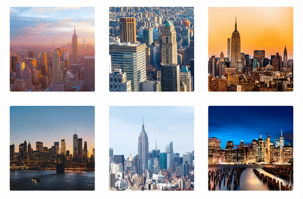

<h1>Galeria-de-imagens</h1>

 
 <h3>Descrição:</h3>
 
Tela de imagens com transição e efeitos usando  CSS e JavaScript.

 
 

   

 
 <h3>Funcionalidade:</h3>
 

- [Acesse o projeto finalizado, online]()
